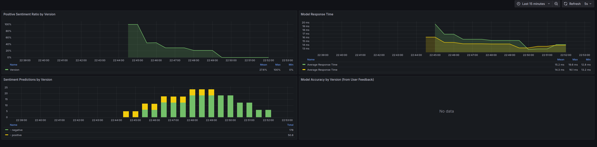

# Continuous Experimentation: Sentiment Analysis Model Comparison

## Experiment Overview

We are conducting an A/B test to compare two versions of our sentiment analysis model service. The experiment aims to evaluate whether our new model version (v2) provides better accuracy and user satisfaction compared to the current version (v1).

### Base Design vs. New Design

**Base Design (v1)**:
- Uses the original sentiment analysis model
- Basic bag-of-words (BoW) vectorization
- Standard classification threshold

**New Design (v2)**:
- Enhanced sentiment analysis model with user feedback incorporation
- Improved text preprocessing
- Optimized classification threshold based on historical data

## Hypothesis

Our falsifiable hypothesis is that the new model version (v2) will:
1. Provide more accurate sentiment predictions (measured through user feedback)
2. Maintain or improve response times
3. Show a more balanced distribution of positive/negative predictions

## Metrics and Decision Process

We are collecting the following metrics through Prometheus and visualizing them in Grafana:

1. **Positive Sentiment Ratio by Version**
   - Tracks the ratio of positive to total predictions for each version
   - Helps identify if one version is biased towards positive/negative predictions
   - Expected: v2 should show a more balanced ratio closer to historical data

2. **Model Response Time**
   - Measures the latency of sentiment predictions
   - Critical for user experience
   - Requirement: v2 should not increase average response time by more than 10%

3. **Sentiment Predictions by Version**
   - Shows the distribution of predictions (positive/negative) for each version
   - Helps identify potential biases or shifts in prediction patterns
   - Expected: v2 should maintain a reasonable distribution based on domain knowledge

4. **Model Accuracy by Version**
   - Based on user feedback (correct/incorrect predictions)
   - Direct measure of model performance
   - Success Criteria: v2 should show at least 5% improvement in accuracy

## Decision Making Process

The experiment will run for a minimum of 2 weeks, with traffic split 50/50 between versions. The decision to adopt v2 will be based on:

1. **Primary Metric**: User-reported accuracy
   - Must show statistically significant improvement (p < 0.05)
   - Minimum 5% absolute improvement over v1

2. **Secondary Metrics**:
   - Response time: Must not degrade by more than 10%
   - Sentiment ratio: Should be within ±10% of historical baseline
   - No significant increase in error rates or failures

3. **Monitoring Process**:
   - Daily review of Grafana dashboard metrics
   - Weekly statistical significance testing
   - Continuous monitoring of system health and error rates

## Implementation Details

The experiment is implemented using:
- Istio for traffic splitting (based on request header `x-user-experiment`)
- Prometheus for metrics collection
- Grafana for visualization and monitoring
- Custom metrics in our application code

### Traffic Splitting Configuration
```yaml
traffic:
  abTesting:
    enabled: true
    matchHeader: x-user-experiment
    controlValue: A
    experimentValue: B
    appVersions:
      - v1
      - v2
    modelVersions:
      - v1
      - v2
```

### Metrics Implementation
- Application-level metrics for sentiment analysis
- Response time tracking
- User feedback collection
- Error rate monitoring

## Dashboard Visualization

Our Grafana dashboard (search for Sentiment Analysis A/B Testing) provides real-time visualization of:
- Sentiment prediction distributions
- Response time comparisons
- Accuracy metrics based on user feedback
- Error rates and system health



The dashboard shows:
- Top Left: Positive Sentiment Ratio by Version - tracking the proportion of positive predictions
- Top Right: Model Response Time - monitoring latency and performance
- Bottom Left: Sentiment Predictions by Version - showing the distribution of predictions
- Bottom Right: Model Accuracy by Version - displaying feedback-based accuracy metrics

## Rollback Plan

If any of the following conditions are met, we will immediately rollback to v1:
1. Error rate increases by more than 5%
2. Response time degrades by more than 20%
3. Critical bugs or security issues are discovered

## Results and Conclusions

[To be filled after the experiment completion] 