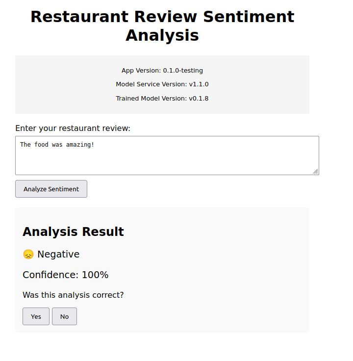
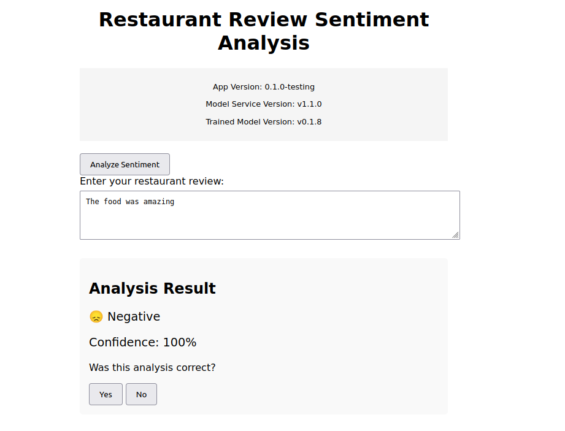

# Continuous Experimentation: Button Placement Analysis

## Experiment Overview

We are conducting an A/B test to evaluate the impact of the "Analyze Sentiment" button placement on user engagement. The experiment aims to determine if placing the button at the top of the interface increases user interaction compared to the original bottom placement.

### Base Design vs. New Design

**Base Design (v1)**:
- Original application layout
- "Analyze Sentiment" button placed at the bottom
- Standard user flow where users need to scroll to submit

  

**New Design (v2)**:
- Identical functionality to v1
- "Analyze Sentiment" button relocated to the top
- Immediate visibility of the action button
  
  


## Hypothesis

Our primary hypothesis is that placing the "Analyze Sentiment" button at the top of the interface will increase the button's click-through rate (CTR). We believe that improved button visibility will lead to higher user engagement.

Specifically, we hypothesize that:
- Users will be more likely to submit text for analysis when the button is immediately visible
- The time-to-first-click will be lower in v2 due to easier button discovery

## Metrics and Decision Process

We are tracking the following metrics through Prometheus and visualizing them in Grafana:

1. **Primary Metric - Button Click-through Rate (CTR)**
   - Calculated as: (Number of Analyze Button Clicks / Number of Page Views) * 100
   - Tracked separately for v1 and v2
   - Measured using the custom metric: `sentiment_button_clicks_total{version="v1|v2"}`
   - Page views tracked using: `page_views_total{version="v1|v2"}`

2. **Secondary Metrics**
   - **Time to First Click**: Average time between page load and first button click
   - **Session Engagement**: Number of analyses per user session
   - **Bounce Rate**: Percentage of users who leave without clicking the button

## Implementation Details

The experiment is implemented using:
- Istio for traffic splitting (90/10 distribution between v1 and v2)
- Prometheus for metrics collection
- Grafana for visualization and monitoring

### Traffic Management Configuration
```yaml
traffic:
  abTesting:
    enabled: true
    appVersions:
      - v1  # Original button placement
      - v2  # Top button placement
    weights:
      - 90  # 90% to v1
      - 10  # 10% to v2
```

### Metrics Implementation

We've added the following custom metrics to track button interaction:

```python
# Button click counter
button_clicks = Counter(
    'sentiment_button_clicks_total',
    'Total number of analyze button clicks',
    ['version']
)

# Page views counter
page_views = Counter(
    'page_views_total',
    'Total number of page views',
    ['version']
)

# Time to first click histogram
time_to_first_click = Histogram(
    'time_to_first_click_seconds',
    'Time from page load to first button click',
    ['version'],
    buckets=[1, 2, 5, 10, 30, 60, float("inf")]
)
```

## Dashboard Visualization (not working properly)

Our Grafana dashboard (Sentiment Analysis A/B Testing) provides real-time visualization of:
- Button CTR comparison between versions
- Time-to-first-click distribution
- Page views and engagement metrics
- Conversion funnel analysis

The dashboard shows:
- Top Left: Real-time CTR comparison
- Top Right: Time to first click distribution
- Bottom Left: Page views by version
- Bottom Right: Conversion funnel

Disclaimer: At the moment of submission, the grafana dashboard does not properly fetch the metrics anymore.

## Success Criteria

We will consider the experiment successful if:
1. V2 shows a statistically significant increase in CTR 
2. The improvement in CTR is at least 15% relative to v1
3. Time to first click shows measurable improvement
4. No negative impact on overall user engagement metrics

## Monitoring and Duration

- Initial rollout: 10% of traffic to v2
- Experiment duration: 2 weeks minimum
- Daily monitoring of metrics
- Statistical significance testing at 1-week mark

## Rollback Plan

We will immediately rollback to 100% v1 if:
1. Significant technical issues arise
2. User engagement metrics show dramatic negative trends
3. Any security or performance issues are detected

## Next Steps

Based on the results of this experiment, we will:
1. If successful: Gradually increase traffic to v2 and eventually make it the new default
2. If unsuccessful: Analyze user behavior data to understand why the new placement didn't improve engagement
3. Document learnings and plan future UI optimization experiments


Current Traffic Split: 90% v1, 10% v2