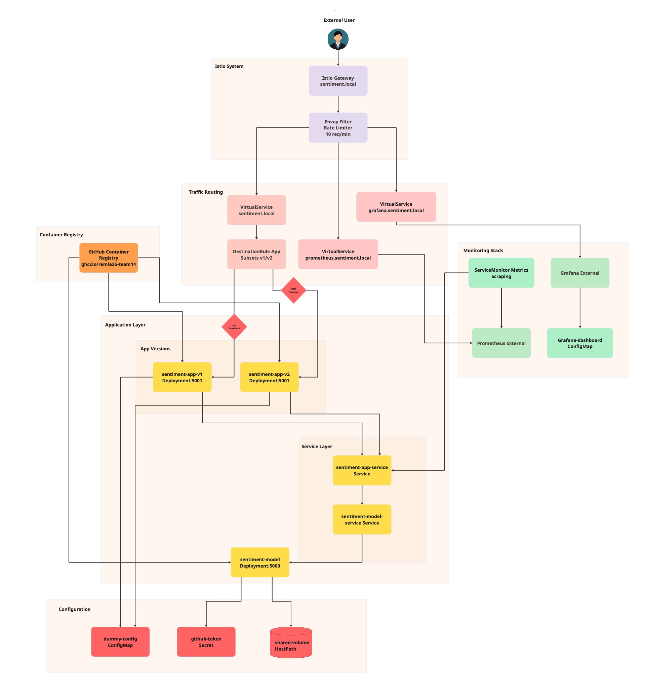
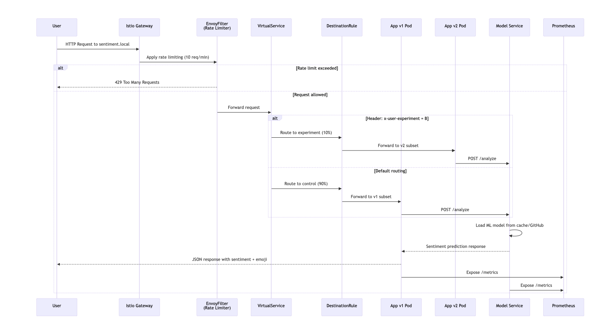

# Deployment Overview

Our REMLA25 sentiment analysis system demonstrates modern cloud-native principles through a Kubernetes deployment enhanced with Istio service mesh. This architecture showcases several key DevOps practices that we've implemented throughout the project.

**Microservices Architecture**: Rather than building a single monolithic application, we've deliberately separated our system into distinct, independent services. Our frontend application handles user interactions and web interfaces, while a dedicated model service focuses exclusively on machine learning inference. This separation provides significant benefits: each service can be developed, deployed, and scaled independently, allowing our team to work more efficiently and deploy updates without affecting the entire system.

**Service Mesh with Istio**: We've chosen to implement Istio as our service mesh, which handles the complex networking between our services. Instead of managing service-to-service communication within our application code, Istio provides this as a dedicated infrastructure layer. Through its sidecar proxy pattern (using Envoy), it automatically manages load balancing, security, observability, and traffic routing between services.

**A/B Testing & Canary Deployments**: One of the most interesting aspects of our deployment is that we run two versions of our frontend application simultaneously. This allows us to conduct controlled experiments where 90% of our users experience the stable version (v1) while 10% interact with our experimental version (v2). If we discover issues with the new version, we can immediately redirect all traffic back to the stable version without any downtime.

**Comprehensive Observability**: We've implemented monitoring throughout our system where every service exposes detailed metrics. Prometheus continuously collects this data, and Grafana transforms it into real-time dashboards that help us understand system health, user behavior, and performance across all components.

## 1. Deployment Topology

   

### **Understanding Our System Components:**

#### **External Layer**
- **External Users**: These are the end users who access our application through standard web browsers. Importantly, they never connect directly to our Kubernetes cluster – all their traffic must first pass through our Istio Gateway, which acts as a controlled entry point.
- **GitHub Container Registry**: This serves as our central repository for Docker images. Whenever Kubernetes needs to create a new pod, it pulls the appropriate Docker image from this registry. We maintain separate versioned images for each of our services: app v1, app v2, and our model service.

#### **Istio System Layer**
- **Istio Gateway**: Think of this component as the main entrance to our Kubernetes cluster. While it functions similarly to a reverse proxy like nginx, it's specifically designed for Kubernetes environments. The gateway listens on port 80 for HTTP traffic and makes intelligent decisions about which requests should be allowed into our cluster. We've configured it to handle multiple hostnames: `sentiment.local` for our main application, `prometheus.sentiment.local` for accessing metrics, and `grafana.sentiment.local` for our monitoring dashboards.

- **EnvoyFilter (Rate Limiter)**: This represents our first line of defense against potential abuse. We've implemented a rate limiting mechanism that restricts each IP address to 10 requests per minute. The system uses what's called a "token bucket" algorithm – imagine each user receives a bucket containing 10 tokens, and every request they make costs one token. These tokens are replenished at a steady rate of 10 per minute. When a user's bucket becomes empty, they receive a "429 Too Many Requests" error, protecting our system from being overwhelmed.

#### **Traffic Routing Layer**
- **VirtualService**: These components function as our intelligent traffic directors. They examine incoming requests and make routing decisions based on predefined rules. We've implemented three VirtualServices in our system:
  - `sentiment-vs`: Handles our main application traffic and implements our A/B testing logic
  - `sentiment-prometheus-vs`: Directs monitoring traffic to Prometheus
  - `sentiment-grafana-vs`: Routes dashboard traffic to Grafana

- **DestinationRule**: This component defines the different "versions" or "subsets" of our application that Istio can route to. It essentially tells Istio: "when you need to send traffic to v1, look for pods labeled with `version: v1`" and "when you need v2, find pods labeled with `version: v2`". This labeling system is fundamental to how our A/B testing works.

#### **Application Layer**
- **App Deployments (v1 & v2)**: These represent two identical deployments of our frontend application, though they may be running different versions of our code. Each deployment manages one or more pods containing our Flask + React application running on port 5001. These pods handle the user interface, process form submissions, and act as intermediaries by forwarding requests to our model service.

- **Model Service Deployment**: This runs our machine learning inference service on port 5000. It's responsible for loading our trained sentiment analysis models from GitHub artifacts and providing a REST API for predictions. By keeping this separate from our frontend, we can scale our ML capabilities independently and potentially reuse this service across different applications in the future.

- **Kubernetes Services**: These provide stable, reliable network addresses for our pods. Since pods are ephemeral by nature (they come and go as needed), Services offer consistent DNS names and IP addresses that don't change. Our app service intelligently exposes both v1 and v2 pods under a single address, while our model service provides a dependable endpoint for machine learning inference.

#### **Configuration Layer**
- **ConfigMap**: This stores non-sensitive configuration data that our applications need to function, such as `LOG_LEVEL=debug` and `APP_MODE=prod`. Rather than hardcoding these values into our Docker images, we can modify them dynamically without rebuilding our containers.

- **Secret**: This provides secure storage for sensitive information – specifically the GitHub token we need to download ML models from private repositories. Kubernetes encrypts this data and only makes it available to authorized pods.

- **Shared Volume**: This represents persistent storage mounted at `/mnt/shared` that survives pod restarts. Our model service uses this volume to cache downloaded ML models, ensuring that we don't need to re-download them every time a pod restarts.

#### **Monitoring Layer**
- **ServiceMonitor**: This instructs Prometheus to "scrape metrics from our app services every 5 seconds by calling their `/metrics` endpoint." It's part of the Prometheus Operator pattern that makes monitoring configuration more manageable in Kubernetes.

- **External Prometheus & Grafana**: These monitoring components run outside our application namespace, possibly in a dedicated monitoring namespace or even external to our cluster. Prometheus continuously collects and stores time-series metrics data, while Grafana creates intuitive visual dashboards from that information.

## 2. Request & Data Flow

   

### **Following a Request Through Our System:**

#### **1. User Initiates Request**
When a user types `sentiment.local` into their browser or when our frontend application makes an API call, that request first encounters our Istio Gateway. The Gateway has been configured to listen for traffic on port 80 and recognizes the hostname `sentiment.local` as legitimate traffic intended for our application.

#### **2. Rate Limiting Protection**
Before any application logic has a chance to run, our EnvoyFilter intercepts the incoming request and performs a rate limit check. The system examines the user's IP address and determines whether they've exceeded our limit of 10 requests within the last minute. This protection occurs at the infrastructure level, which means malicious users cannot overwhelm our application with excessive requests. Our rate limiter implements a token bucket algorithm that works as follows:
- Each IP address starts with a bucket containing 10 tokens
- Every request consumes exactly 1 token
- The system refills tokens at a rate of 10 per minute (approximately 1 every 6 seconds)
- When no tokens remain, the system immediately rejects the request with an HTTP 429 status code

#### **3. Routing Decision Point**
Once the request passes our rate limiting check, our VirtualService examines it to make routing decisions. This is where our A/B testing functionality becomes active:

**Header-Based Routing**: Our VirtualService looks for a specific HTTP header called `x-user-experiment`. 
- When this header contains the value "B", the user becomes part of our experimental group (receiving 10% of total traffic)
- If the header is missing or contains "A", the user receives our control experience (representing 90% of total traffic)
- This header might be set by our frontend application, a load balancer, or generated based on user ID hashing

**Why We Chose Header-Based Over Random Routing**: Headers ensure consistency throughout a user's session – the same user always receives the same experience. Random routing could potentially send a user to v1 for their login process but v2 for their dashboard, creating a confusing and inconsistent experience.

#### **4. DestinationRule Subset Selection**
After our VirtualService makes its routing decision, it forwards the request to our DestinationRule. The DestinationRule doesn't make routing decisions itself – instead, it knows how to locate the appropriate pods:
- For v1 traffic: It finds pods labeled with both `app=sentiment-app` AND `version=v1`
- For v2 traffic: It finds pods labeled with both `app=sentiment-app` AND `version=v2`

Kubernetes then automatically load-balances requests among all healthy pods that match these label criteria.

#### **5. Application Processing**
The selected app pod (either v1 or v2) receives and processes the request. While both versions run essentially the same Flask application, they may contain different features, UI improvements, or bug fixes. The application processes the user's sentiment analysis request through several steps:
- Validating the input text to ensure it meets our requirements
- Making an HTTP POST request to our model service at `http://sentiment-model-service:5000/analyze`
- Enhancing the response with user-friendly elements like emojis and formatting

#### **6. Model Service Inference**
Our model service handles the actual machine learning prediction through the following process:
- **Model Loading**: During its first startup, the service downloads our trained model from GitHub artifacts using our stored GitHub token
- **Caching**: Models are cached in our shared volume, so subsequent pods don't need to repeat the download process
- **Inference**: The model analyzes the submitted text and generates a sentiment prediction (positive/negative) along with confidence scores
- **Response**: The service returns structured JSON containing the prediction results

#### **7. Response Chain**
The response follows the same path back to the user:
- Our model service returns the prediction to the requesting app pod
- The app pod enhances the response with UI improvements (emojis, formatting) and returns it to the user
- This entire process flows through our Istio service mesh, which automatically handles load balancing, retries, and circuit breaking

#### **8. Continuous Monitoring**
Throughout this entire request lifecycle, both our app and model service continuously expose metrics through their `/metrics` endpoints:
- **Request counts**: The total number of requests each service has processed
- **Response times**: How long each request took to complete
- **Error rates**: The number of requests that resulted in failures
- **Business metrics**: The ratio of positive to negative sentiments that we've analyzed

Prometheus scrapes these metrics every 5 seconds, and Grafana displays them in our real-time dashboards, giving us immediate visibility into system performance.

## 3. Deployed Resources 

| Resource Type | Name(s) / Label Pattern | Purpose & Implementation Notes |
|---------------|------------------------|--------------------------------|
| **Namespace** | `default`, `istio-system` | **Logical separation**: We deploy our application resources in the default namespace while Istio infrastructure (like our rate limiter) operates in istio-system for cluster-wide policy enforcement |
| **Deployment** | `sentiment-app-v1`, `sentiment-app-v2` | **Pod management**: Each deployment maintains exactly 1 replica of each app version. They handle rolling updates, health checks, and automatic restarts when needed |
| **Deployment** | `sentiment-model` | **ML service management**: Manages our model inference service pods with proper environment variables for GitHub token and artifact IDs |
| **Service** | `sentiment-app-service` | **Traffic distribution**: A ClusterIP service that intelligently distributes traffic across both v1 and v2 app pods while providing a stable DNS name for internal communication |
| **Service** | `sentiment-model-service` | **Model endpoint**: Provides a stable network address for model inference that app pods can rely on regardless of pod IP changes |
| **Gateway** | `sentiment-gateway` | **Cluster entry point**: An Istio resource that configures our ingress gateway to accept traffic on port 80 for our designated hostnames |
| **VirtualService** | `sentiment-vs`, `sentiment-prometheus-vs`, `sentiment-grafana-vs` | **Intelligent routing**: Define how we route requests based on hostnames, headers, and paths. They implement our A/B testing logic and provide access to monitoring tools |
| **DestinationRule** | `sentiment-app-destination` | **Service mesh configuration**: Defines traffic policies and subsets (v1/v2) for load balancing, enabling Istio to distinguish between our app versions |
| **EnvoyFilter** | `sentiment-rate-limit` | **Security policy**: Configures Envoy proxies in our ingress gateway to enforce rate limiting using the token bucket algorithm for fair usage |
| **ConfigMap** | `dummy-config` | **Configuration storage**: Stores non-sensitive configuration like log levels and app modes that can be updated without rebuilding container images |
| **Secret** | `github-token` | **Credential storage**: Provides encrypted storage for our GitHub personal access token, which Kubernetes automatically mounts into model service pods |
| **ServiceMonitor** | `sentiment-monitor` | **Metrics collection**: A Prometheus Operator resource that configures automatic metric scraping from our app endpoints every 5 seconds |
| **ConfigMap** | `grafana-dashboard-*` | **Dashboard definitions**: Contains JSON configurations for our Grafana dashboards that are automatically loaded for visualizing our metrics |
| **Volume** | `shared-volume` (HostPath) | **Persistent storage**: A host directory mounted into our model service for caching downloaded ML models, ensuring data survives pod restarts |

### **Project Repository Links:**
Our complete project is distributed across several specialized repositories:

- **lib-ml** - https://github.com/remla25-team14/lib-ml
- **lib-version** - https://github.com/remla25-team14/lib-version  
- **app-service** - https://github.com/remla25-team14/app
- **operation** - https://github.com/remla25-team14/operation
- **model-service** - https://github.com/remla25-team14/model-service
- **model-training** - https://github.com/remla25-team14/model-training

