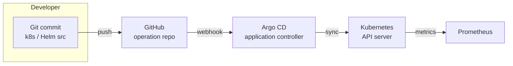

# Extension Proposal - Adopting **GitOps** to Eliminate Manual, Error-Prone Cluster Updates

## 1. Identified Shortcoming

### 1.1 Current Release-Engineering Practice

Some of our deployment pipelines **stop at the image‑publish stage**. Many Kubernetes and Istio manifests (>1000 LOC) reside in the `operation` repository as *raw YAML* and must be applied manually:

```text
$ kubectl apply -f kubernetes/    # developer / CI operator action
```

- The manifests are **not parameterised** (e.g., image tags or canary weights are hard‑coded).
- The cluster state is **imperative**, i.e., *kubectl* pushes changes; the cluster does **not pull** the desired state.
- There is **no automatic rollback** or drift detection.
- Promotion from *staging* to *production* requires copy‑pasting YAML or changing namespaces by hand.

### 1.2 Negative Impact
| Symptom                                                                 | Effect on the team                                  |
| ----------------------------------------------------------------------- | --------------------------------------------------- |
| Inconsistent cluster setups between developers, staging, and production | “Works on my cluster” incidents, debugging overhead |
| Manual `kubectl` steps in run‑books                                     | High cognitive load, onboarding friction            |
| Image tag & manifest mismatch (model‑service vs. app)                   | Broken canary releases; failed experiments          |
| No single source of truth                                               | Configuration drift that silently accumulates       |

> **Criticality — Why this is the *largest* release‑engineering gap**  
> Every subsequent assignment (canary with Istio, continuous experimentation, rate‑limiting policies) relies on quick, reliable redeployments.  Our current manual process is the bottleneck that most frequently breaks or delays release timelines.

---

## 2. Proposed Extension – Full **GitOps** Workflow with Argo CD

GitOps, defined as “using Git as the single source of truth for declarative infrastructure and applications” [1], turns the `operation` repository into the authoritative, **declarative** description of the cluster. A controller (Argo CD⁴ or Flux) continuously reconciles the live state [2] to what is committed in Git.

### 2.1 Architecture Overview


<div align="center">Figure 1 – GitOps reconciliation flow.</div>

As shown in Figure 1, The developer commits the desired cluster state; GitHub stores it as the single source of truth. Argo CD watches for changes, renders the Helm chart, and synchronises the Kubernetes API server to match the committed manifests. Cluster health and synchronisation status are exported as metrics to Prometheus for monitoring and alerting.

- **Helm Chart Migration** – Convert existing YAML into a chart (`charts/remla-all/`).
  - Parameters: `app.image.tag`, `modelService.image.tag`, Istio weights.
- **Argo CD Application CR** tracks the Helm release in *prod* namespace.
- **ApplicationSet** pattern for multi‑environment (optional future extension).

### 2.2 Workflow Changes

1. **Developer** opens PR containing *only* Helm value changes (e.g., set `modelService.image.tag: v1.3.0`).
2. GH‑Actions still build & publish images – but *do not* run `kubectl`.
3. On merge to *main*, Argo CD detects the git diff and automatically:
   - Renders Helm,
   - Applies changed resources,
   - Shows sync status (`Synced ✔︎ / OutOfSync ✖︎`) in its UI & via metrics.
4. Rollback = `argocd app rollback remla-all <rev>` or simply reverting the commit.

### 2.3 Advantages

- **Single Source of Truth** – manifests versioned alongside code.
- **Zero‑drift Guarantee** – Argo CD’s continuous reconciliation catches ad‑hoc `kubectl exec` changes.
- **Auditable Rollouts** – Each production change is a Git commit.
- **Faster Experiments** – Adjusting Istio weights means a single line change (`values.yaml: canaryWeight: 10`).  Lead time approaches *seconds* instead of minutes.
- **Generalisable** – Same pattern scales to any Kubernetes‑based ML application. Many CNCF landscape projects (e.g., Kubeflow, MLflow on K8s) have adopted GitOps

The approach aligns with the four vendor-neutral **GitOps principles** formalised by the CNCF Working Group [3].

---

## 3 Experiment – Does GitOps Improve Release Performance?

| Hypothesis | *Adopting GitOps reduces the **median commit‑to‑production latency** by ≥ X % and eliminates accidental configuration drift.* |
| ---------- |-------------------------------------------------------------------------------------------------------------------------------|

### 3.1 Metrics

| Metric                    | Collection                                                   | Success Threshold    |
| ------------------------- | ------------------------------------------------------------ |----------------------|
| **Lead Time for Changes** | GH‑Actions (`job.completed_at`) → Prometheus [`pushgateway`] | ↓ ≥ X % vs. baseline |
| **Drift Incidents**       | Argo CD metric `argocd_app_sync_total{status="OutOfSync"}`   | W incidents / week   |
| **Change Failure Rate**   | `argocd_app_sync_total{phase="Failed"}` / total syncs        | < Y %                |
| **MTTR** (rollback time)  | `argocd_app_rollback_total` timestamps                       | ↓ ≥ Z %              |
(W, X, Y, Z are flexible metric thresholds for different levels of experiments.)

### 3.2 Method

1. **Baseline** – Keep current manual process for one sprint, record metrics.
2. **Introduce GitOps**, rerun same release volume & experiments for next sprint.
3. Use a Grafana dashboard (a JSON file that this proposal will add at `operation/grafana/gitops-effect.json`) to visualise before/after distributions.
4. **Statistical test**: Mann‑Whitney U on latency samples (α = 0.05).

### 3.3 Expected Outcome

If the hypothesis holds we accept GitOps as the default release path; otherwise we analyse bottlenecks (e.g., Helm rendering time, Argo CD queue length) and iterate.

---

## 4. References

[1] Red Hat. “**What is GitOps?**” *redhat.com*, updated 2025-03-28.  
<https://www.redhat.com/en/topics/devops/what-is-gitops>

[2] *Argo CD — Declarative GitOps CD for Kubernetes*. Docs v2.11, 2025-05-15.  
<https://argo-cd.readthedocs.io/en/stable/>

[3] OpenGitOps Working Group. “**GitOps Principles v1.0**.” CNCF, 2023.  
<https://opengitops.dev/>

> After implementing this extension, every cluster change becomes "just another PR"— aligning our ML system with state‑of‑the‑art release‑engineering practice.